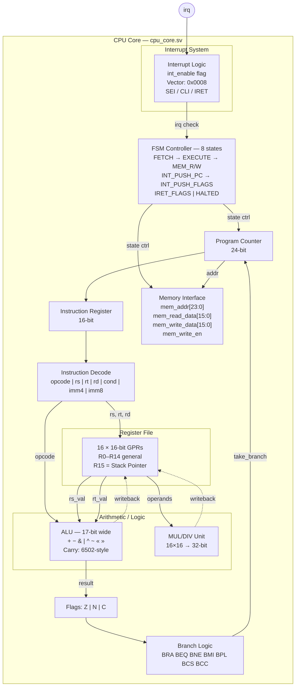
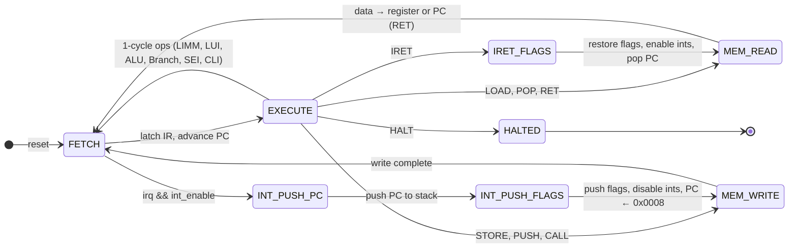
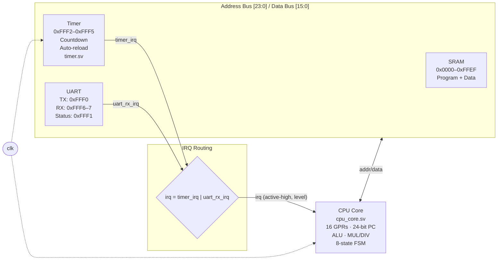

# U1624

A custom 16-bit softcore CPU targeting FPGA, inspired by the **65C816**, **Z8000**, **8086/8088**, **Nintendo SA1**, and **PDP-16**.

## Architecture

- **16-bit fixed-length instructions** — single-cycle decode via wire slices, no microcode
- **16 general-purpose 16-bit registers** (R0–R15, R15 = Stack Pointer)
- **24-bit address bus** (16MB addressable, flat — no segmentation)
- **Multi-state FSM** execution: FETCH → EXECUTE → MEM_READ/MEM_WRITE → FETCH
- **Hardware multiply** (16×16→32) and **divide** with divide-by-zero protection
- **Single-level interrupts** with fixed vector, automatic PC/flag save-restore
- **Memory-mapped I/O** at `0xFFF0`–`0xFFFF` with UART and timer peripherals

## Instruction Set

### Instruction Formats

```
R-Type:  [Opcode (4)][Rs (4)][Rt (4)][Rd (4)]
I-Type:  [Opcode (4)][Rs (4)][Rt (4)][Imm4 (4)]
J-Type:  [Opcode (4)][Rs (4)][Imm8 (8)]
B-Type:  [Opcode (4)][Cond (4)][Offset8 (8)]
```

### Instructions (33 total)

| Category | Mnemonic | Description | Encoding |
|----------|----------|-------------|----------|
| **Data Transfer** | `MOV Rd, Rs` | Register copy | OR Rd, Rs, Rs |
| | `LIMM Rd, Imm8` | Load 8-bit immediate (zeros upper byte) | `0x2` J-Type |
| | `LUI Rd, Imm8` | Load upper immediate (preserves lower byte) | `0x3` J-Type, Imm8≠0 |
| | `LOAD Rt, [Rs+Imm4]` | Load from memory | `0x0` I-Type |
| | `STORE Rt, [Rs+Imm4]` | Store to memory | `0x1` I-Type |
| | `PUSH Rs` | Push to stack (pre-decrement SP) | `0xE` |
| | `POP Rd` | Pop from stack (post-increment SP) | `0x3` J-Type, Imm8=0 |
| **Arithmetic** | `ADD Rd, Rs, Rt` | Add | `0x4` R-Type |
| | `ADDI Rt, Rs, Imm4` | Add immediate | `0x5` I-Type |
| | `SUB Rd, Rs, Rt` | Subtract | `0x8` R-Type |
| | `NEG Rd, Rs` | Two's complement negate | SUB with Rs==Rt |
| | `MUL Rd, Rs, Rt` | Multiply (low 16 bits) | `0xF` ext, Rd R0–R7 |
| | `MULH Rd, Rs, Rt` | Multiply (high 16 bits) | `0xF` ext, Rd R0–R7 |
| | `DIV Rd, Rs, Rt` | Unsigned divide | `0xF` ext, Rd/Rt R0–R7 |
| | `MOD Rd, Rs, Rt` | Unsigned modulo | `0xF` ext, Rd/Rt R0–R7 |
| **Logic** | `AND Rd, Rs, Rt` | Bitwise AND | `0x9` R-Type |
| | `OR Rd, Rs, Rt` | Bitwise OR | `0xA` R-Type |
| | `XOR Rd, Rs, Rt` | Bitwise XOR | `0xB` R-Type |
| | `NOT Rd, Rs` | Bitwise complement | XOR with Rs==Rt |
| **Shift/Rotate** | `SHL Rd, Rs, Rt` | Shift left | `0xC` R-Type |
| | `SHR Rd, Rs, Rt` | Shift right | `0xD` R-Type |
| | `ROL Rd, Rs, Rt` | Rotate left | `0xC` ext, Rd R0–R7 |
| | `ROR Rd, Rs, Rt` | Rotate right | `0xD` ext, Rd R0–R7 |
| **Compare** | `CMPI Rs, Imm4` | Compare immediate (sets flags) | `0x5` with Rt=0 |
| **Control Flow** | `BRA/BEQ/BNE/BMI/BPL Offset8` | Conditional branch | `0x6` B-Type |
| | `CALL Rs` | Call subroutine (push return addr) | `0x7` |
| | `RET` | Return from subroutine | `0x7000` |
| | `JAL Rd, Rs` | Jump and link | `0x7` |
| | `NOP` | No operation | BRA +1 (`0x6001`) |
| | `HALT` | Stop execution | `0xF000` |
| **Interrupts** | `SEI` | Set interrupt enable | `0x7002` |
| | `CLI` | Clear interrupt enable | `0x7003` |
| | `IRET` | Return from interrupt (restore flags + PC) | `0x7001` |
| **Directives** | `.word val, ...` | Embed 16-bit constants | |
| | `.byte val, ...` | Embed 8-bit values (packed 2/word) | |

### Flags

ALU and compare instructions set two flags:
- **Z** (Zero) — result is zero
- **N** (Negative) — result bit 15 is set

Data transfer instructions (LOAD, STORE, PUSH, POP, LIMM, LUI) do not modify flags.

### Interrupts

The CPU supports single-level, non-nestable interrupts with a fixed vector at address `0x0008`.

| Feature | Detail |
|---------|--------|
| Vector address | `0x0008` (fixed) |
| Enable/disable | `SEI` / `CLI` instructions |
| On entry | Push PC and flags to stack, clear interrupt enable, jump to vector |
| On `IRET` | Pop flags and PC from stack, re-enable interrupts |
| Check point | At `S_FETCH` — between instructions, never mid-instruction |
| Nesting | Not supported (interrupts disabled during handler) |

The `irq` input is active-high and level-sensitive. The CPU checks it at the start of each fetch cycle. Programs should place their interrupt handler at address `0x0008` and use a branch at address `0x0000` to skip past it:

```asm
    BRA start           ; skip past vector area
    NOP                 ; padding (addresses 1-7)
    ...

int_handler:            ; address 0x0008
    ; acknowledge interrupt source
    ; handle interrupt
    IRET

start:
    LIMM R15, 60        ; init stack pointer
    SEI                 ; enable interrupts
    ; main program...
```

### Building 16-bit Addresses

`LIMM` loads an 8-bit value (zeroing the upper byte). To construct a full 16-bit address, pair it with `LUI`:

```asm
    LIMM R0, 0xF0       ; R0 = 0x00F0
    LUI  R0, 0xFF       ; R0 = 0xFFF0 (UART TX address)
    STORE R1, [R0 + 0]  ; write to UART
```

## Project Structure

```
U1624/
├── rtl/
│   ├── cpu_core.sv          # CPU core RTL (SystemVerilog)
│   └── timer.sv             # Countdown timer peripheral
├── tests/
│   ├── tb_cpu_core.sv       # Testbench with mock SRAM, UART, and timer
│   ├── test_program.asm     # PDP-16 instruction tests
│   ├── test_interrupts.asm  # Timer-driven interrupt test
│   ├── test_lui.asm         # LUI instruction test
│   └── test_uart_rx.asm     # UART receive test
├── tools/
│   └── assembler.py         # Two-pass assembler CLI tool
└── run_sim.sh               # Build and simulate script
```

## Toolchain

### Assembler

The Python assembler is a standalone CLI tool supporting symbolic labels, all 33 instructions, and data directives:

```bash
# Assemble a source file to program.hex (default output)
python3 tools/assembler.py my_program.asm

# Specify output file
python3 tools/assembler.py my_program.asm -o output.hex

# Verbose mode (print word mapping)
python3 tools/assembler.py my_program.asm -v
```

Example assembly:

```asm
    LIMM  R15, 60          ; Initialize stack pointer
    LIMM  R0, 7
    LIMM  R1, 9
    LIMM  R4, multiply     ; Label reference
    CALL  R4
    HALT

multiply:
    MUL   R2, R0, R1       ; R2 = 7 * 9 = 63
    RET
```

### Simulation

Run the full simulation pipeline (assemble → compile RTL → simulate):

```bash
bash run_sim.sh                        # uses tests/test_program.asm
bash run_sim.sh tests/test_interrupts.asm  # run a specific test
bash run_sim.sh my_program.asm         # run a custom program
```

### Requirements

- [Icarus Verilog](http://iverilog.icarus.com/) (`iverilog`, `vvp`) with `-g2012` flag
- Python 3
- [GTKWave](http://gtkwave.sourceforge.net/) (optional, for viewing `simulation_waves.vcd`)

## Memory Map

| Address Range | Description |
|---------------|-------------|
| `0x000000`–`0x00FFEF` | RAM / Program memory |
| `0x00FFF0` | UART TX Data (W) |
| `0x00FFF1` | UART Status (R) — bit 0: TX ready, bit 1: RX data available |
| `0x00FFF2` | Timer reload value (R/W — also sets count) |
| `0x00FFF3` | Timer current count (R) |
| `0x00FFF4` | Timer control (R/W) — bit 0: enable, bit 1: auto-reload |
| `0x00FFF5` | Timer status (R/W) — bit 0: fired; write to acknowledge |
| `0x00FFF6` | UART RX Data (R: current byte; W: acknowledge/pop) |
| `0x00FFF7` | UART RX Control (R/W) — bit 0: RX interrupt enable |
| `0x00FFF8`–`0x00FFFF` | Reserved I/O |

### Interrupt Sources

The CPU's `irq` line is the OR of all peripheral interrupt outputs:

| Source | Trigger | Acknowledge |
|--------|---------|-------------|
| Timer | Count reaches zero | Write to `0xFFF5` |
| UART RX | Data available (when enabled via `0xFFF7` bit 0) | Write to `0xFFF6` |

## Architecture Diagrams

### CPU Core



### FSM States



### System Overview



## Design Influences

| CPU | What U1624 borrows |
|-----|-------------------|
| **65C816** | 24-bit address bus, clean orthogonal ISA |
| **Z8000** | Large uniform register file (16 GPRs) |
| **8086/8088** | Practical I/O integration philosophy |
| **Nintendo SA1** | Hardware multiply/divide (16×16→32) |
| **PDP-16** | MOV, NOT, NEG, rotate instructions |

## License

BSD 3-Clause — see [LICENSE](LICENSE).
