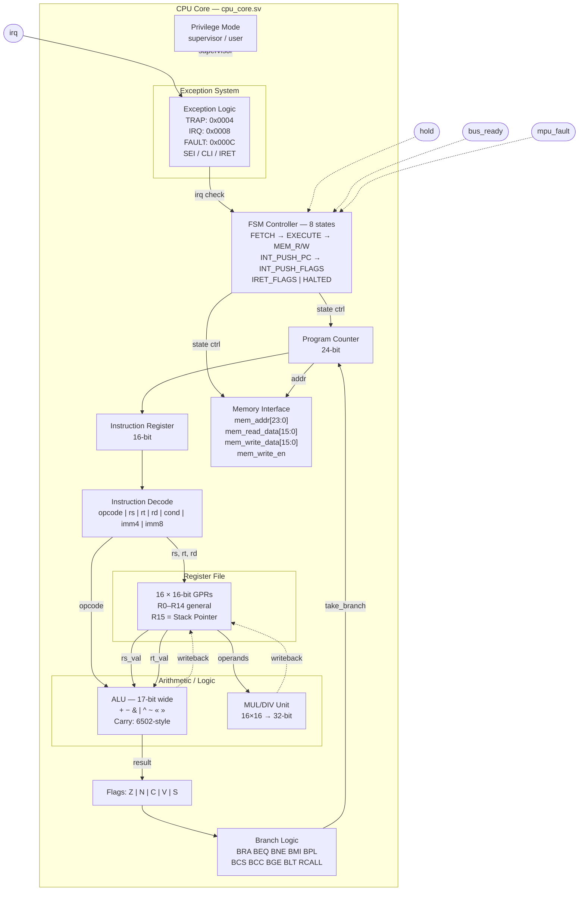
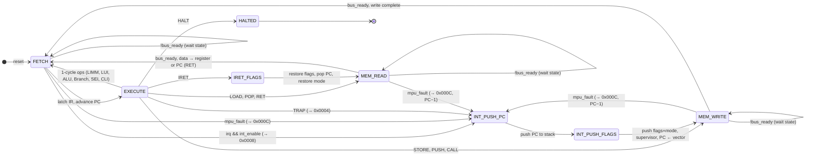
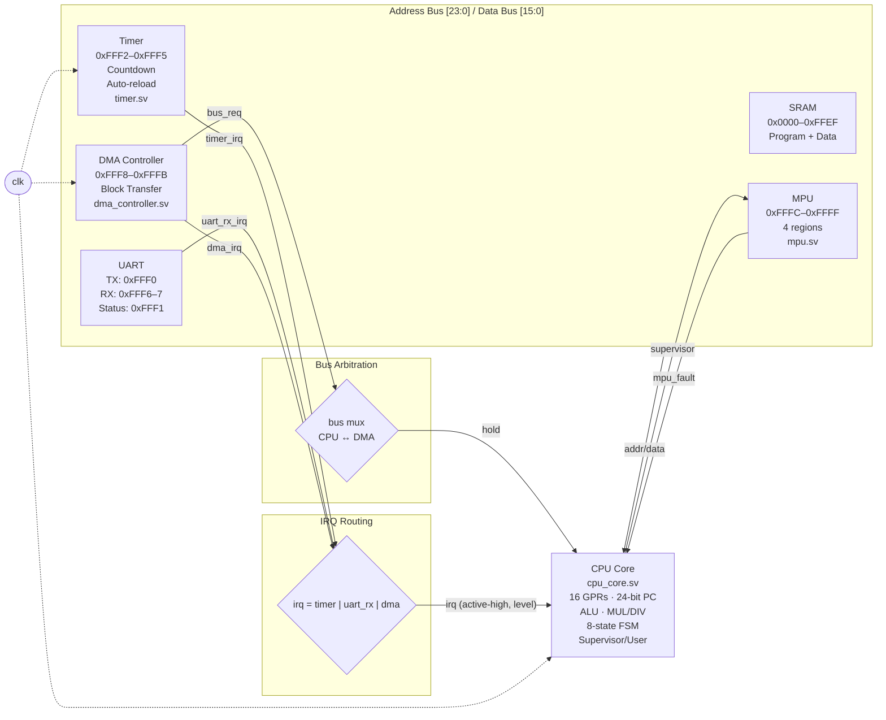

# U1624

A custom 16-bit softcore CPU targeting FPGA, inspired by the **65C816**, **Z8000**, **8086/8088**, **Nintendo SA1**, and **PDP-16**.

## Architecture

- **16-bit fixed-length instructions** — single-cycle decode via wire slices, no microcode
- **16 general-purpose 16-bit registers** (R0–R15, R15 = Stack Pointer)
- **24-bit address bus** (16MB addressable, flat — no segmentation)
- **Multi-state FSM** execution: FETCH → EXECUTE → MEM_READ/MEM_WRITE → FETCH
- **Hardware multiply** (16×16→32) and **divide** with divide-by-zero protection
- **Supervisor/user privilege mode** with automatic mode switching on interrupts, traps, and faults
- **Memory Protection Unit (MPU)** — 4-region base/limit with per-region permissions
- **Single-level interrupts** with three vectors (TRAP, IRQ, FAULT), automatic PC/flag/mode save-restore
- **Memory-mapped I/O** at `0xFFF0`–`0xFFFF` with UART, timer, DMA, and MPU peripherals
- **DMA controller** for CPU-free memory-to-memory block transfers (2 cycles/word)
- **Bus ready / wait states** — active-high `bus_ready` input allows slow memory or I/O to stall the CPU

## Instruction Set

### Instruction Formats

```
R-Type:  [Opcode (4)][Rs (4)][Rt (4)][Rd (4)]
I-Type:  [Opcode (4)][Rs (4)][Rt (4)][Imm4 (4)]
J-Type:  [Opcode (4)][Rs (4)][Imm8 (8)]
B-Type:  [Opcode (4)][Cond (4)][Offset8 (8)]
```

### Instructions (51 total)

| Category | Mnemonic | Description | Encoding |
|----------|----------|-------------|----------|
| **Data Transfer** | `MOV Rd, Rs` | Register copy | OR Rd, Rs, Rs |
| | `LIMM Rd, Imm8` | Load 8-bit immediate (zeros upper byte) | `0x2` J-Type |
| | `LUI Rd, Imm8` | Load upper immediate (preserves lower byte) | `0x3` J-Type, Imm8≠0 |
| | `LOAD Rt, [Rs+Imm4]` | Load from memory | `0x0` I-Type |
| | `STORE Rt, [Rs+Imm4]` | Store to memory | `0x1` I-Type |
| | `PUSH Rs` | Push to stack (pre-decrement SP) | `0xE` |
| | `POP Rd` | Pop from stack (post-increment SP) | `0x3` J-Type, Imm8=0 |
| **Arithmetic** | `ADD Rd, Rs, Rt` | Add | `0x4` R-Type |
| | `ADDI Rt, Rs, Imm4` | Add immediate | `0x5` I-Type |
| | `SUB Rd, Rs, Rt` | Subtract | `0x8` R-Type |
| | `ADC Rd, Rs, Rt` | Add with carry | `0x4` ext, Rd R0–R7 |
| | `SBC Rd, Rs, Rt` | Subtract with borrow | `0x8` ext, Rd R0–R7 |
| | `NEG Rd, Rs` | Two's complement negate | SUB with Rs==Rt |
| | `MUL Rd, Rs, Rt` | Multiply (low 16 bits) | `0xF` ext, Rd R0–R7 |
| | `MULH Rd, Rs, Rt` | Multiply (high 16 bits) | `0xF` ext, Rd R0–R7 |
| | `DIV Rd, Rs, Rt` | Unsigned divide | `0xF` ext, Rd/Rt R0–R7 |
| | `MOD Rd, Rs, Rt` | Unsigned modulo | `0xF` ext, Rd/Rt R0–R7 |
| **Logic** | `AND Rd, Rs, Rt` | Bitwise AND | `0x9` R-Type |
| | `OR Rd, Rs, Rt` | Bitwise OR | `0xA` R-Type |
| | `XOR Rd, Rs, Rt` | Bitwise XOR | `0xB` R-Type |
| | `NOT Rd, Rs` | Bitwise complement | XOR with Rs==Rt |
| **Shift/Rotate** | `SHL Rd, Rs, Rt` | Shift left | `0xC` R-Type |
| | `SHR Rd, Rs, Rt` | Shift right | `0xD` R-Type |
| | `ROL Rd, Rs, Rt` | Rotate left | `0xC` ext, Rd R0–R7 |
| | `ROR Rd, Rs, Rt` | Rotate right | `0xD` ext, Rd R0–R7 |
| **Compare** | `CMPI Rs, Imm4` | Compare immediate (sets flags) | `0x5` with Rt=0 |
| **Control Flow** | `BRA/BEQ/BNE/BMI/BPL/BCS/BCC/BGE/BLT Offset8` | Conditional branch | `0x6` B-Type |
| | `RCALL Offset8` | Relative call (PC + offset, pushes return addr) | `0x6` B-Type, cond=9 |
| | `TRAP Imm8` | Software trap / system call (enters supervisor mode) | `0x6` B-Type, cond=A |
| | `CALL Rs` | Call subroutine (push return addr) | `0x7` |
| | `RET` | Return from subroutine | `0x7000` |
| | `JAL Rd, Rs` | Jump and link | `0x7` |
| | `NOP` | No operation | BRA +1 (`0x6001`) |
| | `HALT` | Stop execution | `0xF000` |
| **Interrupts** | `SEI` | Set interrupt enable | `0x7002` |
| | `CLI` | Clear interrupt enable | `0x7003` |
| | `IRET` | Return from interrupt (restore flags + PC) | `0x7001` |
| **Stack Frame** | `ENTER n` | Set up stack frame (n = 0–15 local words) | `0x7n06` |
| | `LEAVE` | Tear down stack frame | `0x7007` |
| **Register** | `SWAP Rs, Rt` | Exchange register contents | `0x7` Rs, Rt, Rd=C |
| **Block/String** | `MOVSW Rs, Rt` | Copy mem[Rs]→mem[Rt], Rs++, Rt++ | `0x7` Rs, Rt, Rd=D |
| | `LODSW Rs, Rt` | Rs ← mem[Rt], Rt++ | `0x7` Rs, Rt, Rd=E |
| | `STOSW Rs, Rt` | mem[Rs] ← Rt, Rs++ | `0x7` Rs, Rt, Rd=F |
| **Bit Ops** | `BTST Rs, #bit` | Test bit (sets Z flag) | `0x7` Rs, bit=Rt, Rd=8 |
| | `BSET Rs, #bit` | Set bit in Rs | `0x7` Rs, bit=Rt, Rd=9 |
| | `BCLR Rs, #bit` | Clear bit in Rs | `0x7` Rs, bit=Rt, Rd=A |
| | `BTGL Rs, #bit` | Toggle bit in Rs | `0x7` Rs, bit=Rt, Rd=B |
| **Status** | `GETF Rd` | Read status register into Rd | `0x7R04` |
| | `SETF Rs` | Write status register from Rs | `0x7R05` |
| **Directives** | `.word val, ...` | Embed 16-bit constants | |
| | `.byte val, ...` | Embed 8-bit values (packed 2/word) | |

### Flags

ALU and compare instructions set four flags:
- **Z** (Zero) — result is zero
- **N** (Negative) — result bit 15 is set
- **C** (Carry) — set by ADD/ADC/SUB/SBC/ADDI/CMPI (6502 convention: C=1 on ADD overflow, C=1 on SUB when no borrow)
- **V** (Overflow) — signed overflow detected (result sign wrong for the operand signs)

ADC and SBC use the carry flag as input for multi-word arithmetic chains. BGE and BLT use the overflow flag with N for correct signed comparisons (branch condition is N==V and N!=V respectively). Data transfer instructions (LOAD, STORE, PUSH, POP, LIMM, LUI) do not modify flags.

The status register can be read/written as a single value with `GETF`/`SETF`:

| Bit | Flag | Description |
|-----|------|-------------|
| 0 | Z | Zero |
| 1 | N | Negative |
| 2 | C | Carry |
| 3 | I | Interrupt enable |
| 4 | V | Overflow (signed) |
| 5 | S | Supervisor mode (1=supervisor, 0=user) |

### Interrupts and Exceptions

The CPU supports three exception types, each with a fixed vector address. All entries push PC and flags (including the saved privilege mode) to the stack, switch to supervisor mode, disable interrupts, and jump to the vector.

| Vector | Address | Trigger | Use |
|--------|---------|---------|-----|
| TRAP | `0x0004` | `TRAP n` instruction | System calls |
| IRQ | `0x0008` | Hardware `irq` input (level-sensitive, active-high) | Peripheral interrupts |
| FAULT | `0x000C` | MPU access violation | Memory protection |

| Feature | Detail |
|---------|--------|
| Enable/disable | `SEI` / `CLI` instructions (affects IRQ only) |
| On entry | Save mode, enter supervisor, push PC + flags, disable ints, jump to vector |
| On `IRET` | Pop flags + PC, restore privilege mode, re-enable interrupts |
| IRQ check | At `S_FETCH` — between instructions, never mid-instruction |
| Fault check | At `S_FETCH`, `S_MEM_READ`, `S_MEM_WRITE` — data faults save PC−1 for retry |
| Nesting | Not supported (interrupts disabled during handler) |

Programs should place handlers at the vector addresses:

```asm
    BRA start           ; 0x0000 — skip past vectors
    NOP                 ; 0x0001
    NOP                 ; 0x0002
    NOP                 ; 0x0003

trap_handler:           ; 0x0004 — TRAP vector
    ; handle system call (trap number in imm8)
    IRET

    NOP                 ; padding to reach 0x0008

irq_handler:            ; 0x0008 — IRQ vector
    ; acknowledge interrupt source
    IRET

    NOP                 ; padding to reach 0x000C

fault_handler:          ; 0x000C — FAULT vector
    ; handle protection fault
    HALT                ; or adjust return addr and IRET

start:
    LIMM R15, 60        ; init stack pointer
    SEI                 ; enable interrupts
    ; main program (supervisor mode)...
```

### DMA Controller

The DMA controller performs memory-to-memory block transfers without CPU intervention. The CPU programs the source, destination, and length, then starts the transfer. The DMA takes over the memory bus (freezing the CPU via the `hold` signal) and copies at 2 cycles per word. When done, the CPU resumes.

```asm
    ; Copy 10 words from address 0x100 to address 0x200
    LIMM  R3, 0xF8
    LUI   R3, 0xFF           ; R3 = 0xFFF8 (DMA base)
    LIMM  R0, 0x00
    LUI   R0, 0x01           ; R0 = 0x0100
    STORE R0, [R3 + 0]       ; DMA src = 0x0100
    LIMM  R0, 0x00
    LUI   R0, 0x02           ; R0 = 0x0200
    STORE R0, [R3 + 1]       ; DMA dst = 0x0200
    LIMM  R0, 10
    STORE R0, [R3 + 2]       ; DMA len = 10
    LIMM  R0, 0x01
    STORE R0, [R3 + 3]       ; Start! CPU freezes, resumes when done.
```

### Wait States (Bus Ready)

The `bus_ready` input allows slow memory or I/O devices to insert wait states. When `bus_ready` is low during a fetch, read, or write, the CPU stalls in its current state until the device asserts ready. Modeled after the Z80/8086 READY pin.

| State | Behavior when `bus_ready` = 0 |
|-------|-------------------------------|
| `S_FETCH` | Holds — instruction not latched, interrupts not checked |
| `S_MEM_READ` | Holds — read data not sampled |
| `S_MEM_WRITE` | Holds — `mem_write_en` stays asserted |

Tie `bus_ready` high for zero-wait-state memory. In the testbench, SRAM addresses >= 50 simulate a slow device with 1 wait state per access.

### Supervisor / User Mode

The CPU has two privilege levels controlled by bit 5 (S) of the status register:

| Mode | S bit | Description |
|------|-------|-------------|
| Supervisor | 1 | Full access — MPU bypassed, can modify S bit via `SETF` |
| User | 0 | Restricted — MPU enforced, `SETF` cannot set S bit |

The CPU starts in supervisor mode on reset. It enters supervisor mode automatically on any exception (IRQ, TRAP, FAULT). The previous mode is saved in the stacked flags word and restored by `IRET`.

To drop to user mode, use the fake-IRET pattern:

```asm
    LIMM R1, user_entry  ; target address
    PUSH R1               ; push as return PC
    GETF R1               ; get current flags
    LIMM R3, 0xDF
    LUI  R3, 0xFF         ; mask = 0xFFDF (clear S bit)
    AND  R1, R1, R3
    PUSH R1               ; push flags with S=0
    IRET                   ; "return" to user mode
```

### Memory Protection Unit (MPU)

The MPU provides 4 memory regions with base/limit bounds checking and per-region permissions. It is memory-mapped at `0xFFFC`–`0xFFFF` using indirect register access.

| Address | Register | Description |
|---------|----------|-------------|
| `0xFFFC` | Control | `[15]` = global enable, `[1:0]` = region select (0–3) |
| `0xFFFD` | Base | Base address of selected region |
| `0xFFFE` | Limit | Limit address of selected region (inclusive) |
| `0xFFFF` | Permissions | Permission bits of selected region |

**Permission bits** (per region):

| Bit | Meaning |
|-----|---------|
| 0 | User read (and execute) |
| 1 | User write |
| 7 | Region enable |

**How it works:** When the MPU is enabled and the CPU is in user mode, every memory access is checked against all enabled regions in parallel. If any region covers the address and grants the requested permission (read or write), the access proceeds. If no region matches, a fault is raised (vector `0x000C`). Supervisor mode bypasses all MPU checks.

```asm
    ; Configure region 0: addresses 20-49, user read/write
    LIMM R0, 0xFC
    LUI  R0, 0xFF         ; R0 = 0xFFFC (MPU base)
    LIMM R1, 0
    STORE R1, [R0 + 0]    ; select region 0, MPU off
    LIMM R1, 20
    STORE R1, [R0 + 1]    ; base = 20
    LIMM R1, 49
    STORE R1, [R0 + 2]    ; limit = 49
    LIMM R1, 0x83
    STORE R1, [R0 + 3]    ; perms = enabled | user R/W
    LIMM R1, 0x00
    LUI  R1, 0x80         ; R1 = 0x8000 (global enable)
    STORE R1, [R0 + 0]    ; enable MPU
```

### Building 16-bit Addresses

`LIMM` loads an 8-bit value (zeroing the upper byte). To construct a full 16-bit address, pair it with `LUI`:

```asm
    LIMM R0, 0xF0       ; R0 = 0x00F0
    LUI  R0, 0xFF       ; R0 = 0xFFF0 (UART TX address)
    STORE R1, [R0 + 0]  ; write to UART
```

### Stack Frames

`ENTER` and `LEAVE` provide hardware-assisted function prologue/epilogue. R14 is the dedicated frame pointer (FP), R15 is the stack pointer (SP).

| Instruction | Operation |
|-------------|-----------|
| `ENTER n` | Push R14, R14 ← SP, SP ← SP − n (allocate n local words) |
| `LEAVE` | SP ← R14 + 1, Pop R14 (deallocate frame, restore caller's FP) |

The frame size `n` (0–15) is encoded directly in the instruction. After `ENTER`, the frame looks like:

```
[R14 + 2]  → first parameter (pushed by caller before CALL)
[R14 + 1]  → return address (pushed by CALL)
[R14]      → saved old R14 (pushed by ENTER)
[R14 − 1]  → local variable 0
[R14 − n]  → local variable n−1 ← SP
```

Example function with locals:

```asm
my_func:
    ENTER 2              ; save FP, allocate 2 local words
    ; ... use locals via computed offsets from R14 ...
    LEAVE                ; restore FP and SP
    RET                  ; return to caller
```

## Project Structure

```
U1624/
├── rtl/
│   ├── cpu_core.sv          # CPU core RTL (SystemVerilog)
│   ├── mpu.sv               # Memory Protection Unit (4 regions)
│   ├── timer.sv             # Countdown timer peripheral
│   └── dma_controller.sv   # DMA controller for block transfers
├── tests/
│   ├── tb_cpu_core.sv       # Testbench with mock SRAM, UART, and timer
│   ├── test_program.asm     # PDP-16 instruction tests
│   ├── test_interrupts.asm  # Timer-driven interrupt test
│   ├── test_lui.asm         # LUI instruction test
│   ├── test_uart_rx.asm     # UART receive test
│   ├── test_carry.asm       # Carry flag and BCS/BCC test
│   ├── test_adc_sbc.asm     # ADC/SBC multi-word arithmetic test
│   ├── test_status_reg.asm  # GETF/SETF status register test
│   ├── test_signed_branch.asm # BGE/BLT signed comparison test
│   ├── test_stack_frame.asm # ENTER/LEAVE stack frame test
│   ├── test_dma.asm         # DMA block transfer test
│   ├── test_rcall.asm       # RCALL relative call test
│   ├── test_wait_states.asm # Bus ready / wait state test
│   ├── test_bit_ops.asm     # BTST/BSET/BCLR/BTGL bit operation test
│   ├── test_swap.asm        # SWAP register exchange test
│   ├── test_string_ops.asm  # MOVSW/LODSW/STOSW block move test
│   └── test_mpu.asm         # MPU / supervisor mode / TRAP test
├── tools/
│   └── assembler.py         # Two-pass assembler CLI tool
└── run_sim.sh               # Build and simulate script
```

## Toolchain

### Assembler

The Python assembler is a standalone CLI tool supporting symbolic labels, all instructions, and data directives:

```bash
# Assemble a source file to program.hex (default output)
python3 tools/assembler.py my_program.asm

# Specify output file
python3 tools/assembler.py my_program.asm -o output.hex

# Verbose mode (print word mapping)
python3 tools/assembler.py my_program.asm -v
```

Example assembly:

```asm
    LIMM  R15, 60          ; Initialize stack pointer
    LIMM  R0, 7
    LIMM  R1, 9
    LIMM  R4, multiply     ; Label reference
    CALL  R4
    HALT

multiply:
    MUL   R2, R0, R1       ; R2 = 7 * 9 = 63
    RET
```

### Simulation

Run the full simulation pipeline (assemble → compile RTL → simulate):

```bash
bash run_sim.sh                        # uses tests/test_program.asm
bash run_sim.sh tests/test_interrupts.asm  # run a specific test
bash run_sim.sh my_program.asm         # run a custom program
```

### Requirements

- [Icarus Verilog](http://iverilog.icarus.com/) (`iverilog`, `vvp`) with `-g2012` flag
- Python 3
- [GTKWave](http://gtkwave.sourceforge.net/) (optional, for viewing `simulation_waves.vcd`)

## Memory Map

| Address Range | Description |
|---------------|-------------|
| `0x000000`–`0x00FFEF` | RAM / Program memory |
| `0x00FFF0` | UART TX Data (W) |
| `0x00FFF1` | UART Status (R) — bit 0: TX ready, bit 1: RX data available |
| `0x00FFF2` | Timer reload value (R/W — also sets count) |
| `0x00FFF3` | Timer current count (R) |
| `0x00FFF4` | Timer control (R/W) — bit 0: enable, bit 1: auto-reload |
| `0x00FFF5` | Timer status (R/W) — bit 0: fired; write to acknowledge |
| `0x00FFF6` | UART RX Data (R: current byte; W: acknowledge/pop) |
| `0x00FFF7` | UART RX Control (R/W) — bit 0: RX interrupt enable |
| `0x00FFF8` | DMA Source Address (R/W) |
| `0x00FFF9` | DMA Destination Address (R/W) |
| `0x00FFFA` | DMA Transfer Length in words (R/W) |
| `0x00FFFB` | DMA Control/Status (R/W) — bit 0: start/busy, bit 1: int enable, bit 2: done |
| `0x00FFFC` | MPU Control (R/W) — bit 15: enable, bits 1:0: region select |
| `0x00FFFD` | MPU Region Base Address (R/W) |
| `0x00FFFE` | MPU Region Limit Address (R/W) |
| `0x00FFFF` | MPU Region Permissions (R/W) — bit 7: enable, bit 1: user W, bit 0: user R |

### Interrupt Sources

The CPU's `irq` line is the OR of all peripheral interrupt outputs:

| Source | Trigger | Acknowledge |
|--------|---------|-------------|
| Timer | Count reaches zero | Write to `0xFFF5` |
| UART RX | Data available (when enabled via `0xFFF7` bit 0) | Write to `0xFFF6` |
| DMA | Transfer complete (when enabled via `0xFFFB` bit 1) | Start new transfer or clear int enable |

## Architecture Diagrams

### CPU Core



### FSM States



### System Overview



## Design Influences

| CPU | What U1624 borrows |
|-----|-------------------|
| **65C816** | 24-bit address bus, clean orthogonal ISA |
| **Z8000** | Large uniform register file (16 GPRs) |
| **8086/8088** | Practical I/O integration philosophy |
| **Nintendo SA1** | Hardware multiply/divide (16×16→32) |
| **PDP-16** | MOV, NOT, NEG, rotate instructions |

## License

BSD 3-Clause — see [LICENSE](LICENSE).
